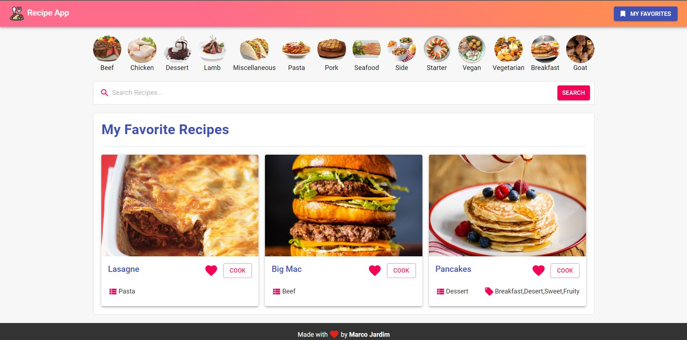

<h3>Demo: https://recipe-app-two.now.sh/</h3>

<h1 align="center">
  
</h1>

<h3 align="center">
  A web app to search and save favorites recipes using TheMealDB API
</h3>

<p align="center">
  <a href="https://app.circleci.com/pipelines/github/santarelle/recipe-app?branch=dev">
    
  </a>
  
  
  
  
  
  <a href="https://github.com/santarelle/recipe-app/commits/master">
    
  </a>
  
  <a href="https://github.com/santarelle/recipe-app/issues">
    
  </a>
</P>

<p align="center">

  <a href="https://github.com/santarelle" target="_blank">
    
  </a>
  <a href="https://github.com/santarelle" target="_blank">
    
  </a>
  <a href="https://br.linkedin.com/in/marco-santarelle-da-silva-jardim-csm-cspo-csd-78b21066" target="_blank" >
    
  </a>
  <a href="mailto:santarelle@gmail.com" target="_blank" >
    
  </a>
</p>

<p align="center">
  <a href="#computer-languages">Languages</a>&nbsp;&nbsp;&nbsp;|&nbsp;&nbsp;&nbsp;
  <a href="#books-technologies">Technologies</a>&nbsp;&nbsp;&nbsp;|&nbsp;&nbsp;&nbsp;
  <a href="#install">Install</a>&nbsp;&nbsp;&nbsp;|&nbsp;&nbsp;&nbsp;
  <a href="#books-usage">Usage</a>&nbsp;&nbsp;&nbsp;|&nbsp;&nbsp;&nbsp;
  <a href="#user-stories">User Stories</a>&nbsp;&nbsp;&nbsp;
</p>

## :computer: Languages

- **TypeScript**

## :books: Technologies

- **React**
- **ESLint**
- **Prettier**
- **Redux**
- **SASS**
- **Material UI**
- **Circle CI**

## Install

```sh
npm install
```

## Usage

```sh
npm start
```

## User Stories
-   User can see a list of recipe titles
-   User can click a recipe title to display a recipe card containing the
recipe title, meal type (breakfast, lunch, supper, or snack), number of people
it serves, its difficulty level (beginner, intermediate, advanced), the list
of ingredients (including their amounts), and the preparation steps.
-   User click a new recipe title to replace the current card with a new
recipe.
-   User can see a photo showing what the item looks like after it has
been prepared.
-   User can search for a recipe not in the list of recipe titles by
entering the meal name into a search box and clicking a 'Search' button. Any
open source recipe API may be used as the source for recipes (see The MealDB
below).
-   User can see a list of recipes matching the search terms
-   User can click the name of the recipe to display its recipe card.
-   User can see a warning message if no matching recipe was found.
-   User can click a 'Save' button on the cards for recipes located through
the API to save a copy to this apps recipe file or database.

## Author

👤 **Marco Jardim**

* Github: [@santarelle](https://github.com/santarelle)
---

Made by :red_heart: by [Marco Jardim](https://github.com/santarelle)